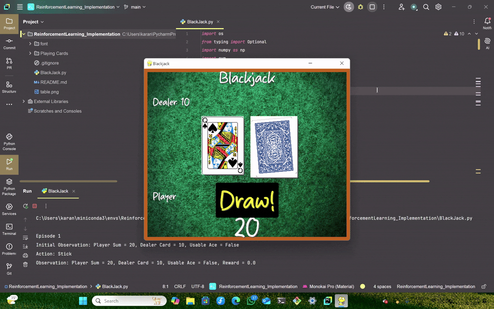

Blackjack Game with Reinforcement Learning
A Python-based Blackjack game that combines reinforcement learning concepts with an interactive Pygame interface. This project allows players to engage in a classic Blackjack game with a 52-card deck, visual card displays, and interactive controls. The game has been enhanced to remove fixed seeds, ensuring varied gameplay each time.
Features

Interactive Gameplay: Play Blackjack with keyboard controls (H to hit, S to stick, Q to quit).
Visual Interface: Uses Pygame to display cards, player/dealer sums, and game results.
Realistic Deck: Implements a 52-card deck with suits and shuffling for varied gameplay.
Dynamic Outcomes: Dealer follows standard Blackjack rules (hits on 16, stands on 17).
Customizable: Easily modifiable code to add new features or strategies.

Demo Video
Below is a video showcasing the gameplay of the Blackjack game. Watch it to see how the game looks and plays!

Python: Version 3.6 or higher
Pygame: For rendering the game interface
Gym: For the reinforcement learning environment
NumPy: For numerical operations

Install the dependencies using pip:
pip install pygame gym numpy

Installation

Clone the Repository:Clone this project from GitHub to your local machine:
git clone https://github.com/Karan825/ReinforcementLearning_Implementation.git
cd ReinforcementLearning_Implementation

Install Dependencies:Ensure you have Python installed, then install the required libraries:
pip install pygame gym numpy

Run the Game:Start the game by running the main script:
python BlackJack.py

How to Play

Start the Game:

Run python BlackJack.py to launch the game.
A Pygame window will open, displaying the Blackjack table, player cards, and dealer’s visible card.

Gameplay Controls:

Hit (H): Draw another card to increase your hand’s sum.
Stick (S): End your turn and let the dealer play.
Quit (Q): Exit the game at any time.
The goal is to get a hand sum as close to 21 as possible without going over (busting).

Rules:

The dealer must hit if their sum is less than 17 and stand on 17 or higher.
Aces can be worth 1 or 11 (automatically calculated for the best outcome).
The game runs for 3 episodes by default, showing the result of each round (win, lose, or draw).

Example Gameplay:

Initial Hand: Player Sum = 15, Dealer Card = 8
Press H to hit → Draw a 3 → Player Sum = 18
Press S to stick → Dealer reveals their hand (e.g., 16), hits (draws a 6 → 22), and busts.
Result: You Win!

Project Structure

BlackJack.py: The main script containing the game logic, Pygame rendering, and reinforcement learning environment.
Playing Cards/: Directory containing PNG images of all 52 cards (e.g., ace_of_spades.png, 2_of_hearts.png).
font/: Contains Roboto-Regular.ttf for rendering text in the game.
table.png: (Optional) Background image for the Blackjack table.
.gitignore: Excludes PyCharm settings (.idea/), Python cache (__pycache__/), and virtual environments (venv/, env/).

Contributing
Contributions are welcome! If you’d like to improve this project, follow these steps:

Fork the repository.
Create a new branch (git checkout -b feature/your-feature).
Make your changes and commit them (git commit -m "Add your feature").
Push to your branch (git push origin feature/your-feature).
Open a Pull Request on GitHub.

Ideas for contributions:

Add sound effects for card draws and game outcomes.
Implement a more advanced reinforcement learning strategy.
Enhance the UI with animations or a more detailed table design.

License
This project is licensed under the MIT License. Feel free to use, modify, and distribute it as you wish.
Acknowledgements

Built with Pygame for game rendering.
Uses Gym for the reinforcement learning environment.
Card images sourced from OpenGameArt (or specify your source if different).

Created by Karan825 on June 11, 2025.
